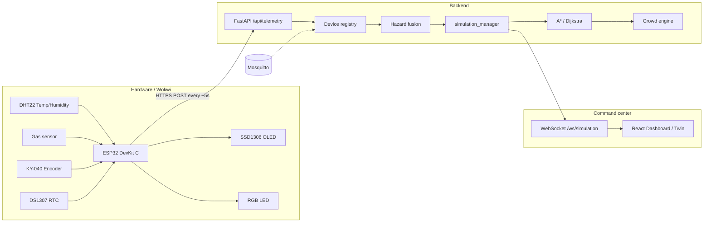

# FireExit — Smart Fire Evacuation Digital Twin


**DEMONSTARTION VIDEO:https://drive.google.com/file/d/1K-dH9B_7eQ0u77p69C5syXvKMY3LUThT/view?usp=sharing ***
**PLEASE VIEW FOR CLEARER UNDERSTANDING**

Real-time **command-center digital twin** for fire evacuation: ESP32 sensors → FastAPI hazard + multi-exit A* + crowd sim → React / Three.js ops UI.

**Stack:** FastAPI · React 19 · R3F · MQTT · Docker · Wokwi / ESP32

---

## High-level system design



| Layer | Role |
|-------|------|
| **Edge** | Sense temp, humidity, gas; show status on OLED / RGB; POST telemetry |
| **Backend** | Validate → registry → hazard → twin rooms → routes → crowd → WS/MQTT |
| **UI** | Live floor plan, 3D twin, IoT SCADA, occupancy, analytics |

---

## Modules

| Module | Path | Responsibility |
|--------|------|----------------|
| **API** | `backend/app/api/` | Auth, simulation, IoT telemetry, building, analytics, alerts, WebSocket |
| **Engines** | `backend/app/engines/` | Hazard fusion · multi-exit A*/Dijkstra |
| **Simulation** | `backend/app/simulation/` | Tick loop, fire containment, crowd, `simulation_manager` |
| **Services** | `backend/app/services/` | Telemetry pipeline, device registry (15s offline), MQTT bridge |
| **Persistence** | `backend/app/db/`, `repositories/` | Devices, samples, alerts, layouts |
| **Frontend** | `frontend/src/` | Dashboard, Twin, Designer, IoT, Occupancy, Analytics, Settings |
| **Firmware** | `firmware/` | ESP32 Arduino / Wokwi sketch |
| **Infra** | `docker-compose.yml`, `infra/` | Backend, frontend, Redis, Mosquitto, optional Postgres / ngrok |

### Frontend pages

| Route | Purpose |
|-------|---------|
| `/dashboard` | Map-first command view + KPIs + alerts |
| `/twin` | 3D R3F digital twin + sim controls |
| `/designer` | Building graph editor → deploy layout |
| `/iot` | Sensor network SCADA |
| `/occupancy` | People by status (safe / evacuating / trapped) |
| `/analytics` | Trends, heatmap, exit use |
| `/settings` | Preferences |

---

## Data flow

```
ESP32 / Wokwi
    │  POST /api/telemetry  { deviceId, room, floor, temperature, humidity,
    │                         gasLevel, status: SAFE|WARNING|CRITICAL, flame, … }
    ▼
FastAPI validate (TelemetryPayload)
    ▼
Device registry  →  SQLite/Postgres  →  MQTT fireexit/device/{id}
    ▼
Twin room update (SAFE clears fire; WARNING/CRITICAL can auto-ignite + start sim)
    ▼
Hazard score → edge weights → A* exits → occupants evacuate
    ▼
WebSocket snapshot/tick/telemetry → Dashboard / Twin / IoT UI
```

**Status rules (edge → twin)**

| Sensor outcome | Twin behavior |
|----------------|---------------|
| `SAFE` | Clear fire/alarm on mapped room; LED green |
| `WARNING` / high gas or temp | Alarm; may start evacuation |
| `CRITICAL` / flame | Ignite room (contained — no spread to neighbors); auto-start `simulation_manager` |

**Public ingest:** `POST /api/telemetry` (no JWT).  
**Ops APIs:** JWT (`admin` / `operator` / `viewer`).

---

## Hardware (Wokwi / ESP32)

Wokwi diagram (ESP32 DevKit C v4 + peripherals):

| Part | Role | ESP32 pins (from diagram) |
|------|------|---------------------------|
| **ESP32 DevKit C v4** | MCU, Wi‑Fi, HTTPS client | — |
| **DHT22** | Temperature + humidity | DATA → **GPIO 4**, VCC 3V3, GND |
| **Gas sensor** | Air / smoke proxy (ADC + digital) | AOUT → **GPIO 34**, DOUT → **GPIO 27**, VCC 5V |
| **KY-040 encoder** | Local UI / mode select | CLK **18**, DT **19**, SW **23** |
| **DS1307 RTC** | Timestamp (I²C) | SDA **21**, SCL **22**, 5V |
| **SSD1306 OLED** | Local status display (I²C `0x3C`) | SDA **21**, SCL **22**, 3V3 |
| **RGB LED** | SAFE / WARNING / CRITICAL | R **25**, G **26**, B **33**, COM GND |

```text
                    ┌─────────────┐
   DHT22 ──────────►│             │──────► SSD1306 OLED (I²C)
   Gas AOUT/DOUT ──►│  ESP32      │──────► RGB LED
   KY-040 ─────────►│  DevKit C   │
   DS1307 (I²C) ───►│             │──────► Wi‑Fi ──► POST /api/telemetry
                    └─────────────┘
```

Firmware sketch: [`firmware/esp32_fireexit_telemetry.ino`](firmware/esp32_fireexit_telemetry.ino)  
Wokwi diagram: [`firmware/wokwi.diagram.json`](firmware/wokwi.diagram.json)  
Set `API_BASE` to your tunnel or Railway URL (Wokwi cannot reach `localhost`).

Tunnel options: [docs/PUBLIC_TUNNEL.md](docs/PUBLIC_TUNNEL.md) (Cloudflare / ngrok).

---

## Algorithms (short)

| Engine | Logic |
|--------|--------|
| **Hazard** | `Risk ≈ 0.4·flame + 0.3·smoke + 0.2·temp + 0.1·crowd` → edge cost |
| **Pathfinding** | Multi-exit A* (Dijkstra available); congestion + hazard on edges |
| **Fire** | Intensifies **in-room only** (no neighbor ignition) |
| **Crowd** | Follow routes; trapped if no path; SAFE/all-clear releases occupants |

---

## Quick start

```bash
# Backend
cd backend
python -m venv .venv
.venv\Scripts\activate          # Windows
pip install -r requirements.txt
uvicorn app.main:app --host 0.0.0.0 --port 8000

# Frontend
cd frontend
npm install
npm run dev
```

| Service | URL |
|---------|-----|
| UI | http://localhost:5173 |
| API / docs | http://localhost:8000/docs |


| User | Password | Role |
|------|----------|------|
| admin | admin123 | Full |
| operator | operator123 | Simulate |
| viewer | viewer123 | Read-only |

### Smoke-test telemetry

```powershell
Invoke-RestMethod -Method POST -Uri "http://localhost:8000/api/telemetry" `
  -ContentType "application/json" `
  -Body '{"deviceId":"DEV001","room":"Office 101","type":"ROOM","floor":1,"temperature":42,"humidity":35,"gasLevel":1300,"status":"WARNING","battery":88,"signal":-62,"flame":false}'
```

---

## Deploy & tunnel

| Target | Doc |
|--------|-----|
| Docker / capacity / security | [docs/DEPLOYMENT.md](docs/DEPLOYMENT.md) |
| Railway backend | [docs/DEPLOYMENT.md#railway-backend](docs/DEPLOYMENT.md#railway-backend) |
| Cloudflare / ngrok for Wokwi | [docs/PUBLIC_TUNNEL.md](docs/PUBLIC_TUNNEL.md) |
| Architecture detail | [docs/ARCHITECTURE.md](docs/ARCHITECTURE.md) |
| REST / WS / MQTT | [docs/API.md](docs/API.md) |

```powershell
# Cloudflare quick tunnel → local :8000
cloudflared tunnel --url http://127.0.0.1:8000
```

---

## Project layout

```
FIRE-EXIT/
├── backend/           # FastAPI, engines, simulation_manager, tests, Railway
├── frontend/          # React command center
├── firmware/          # ESP32 / Wokwi telemetry sketch
├── docs/              # Architecture, API, Deployment, Public Tunnel
├── infra/             # Mosquitto config
├── scripts/           # ngrok helper, inject_timeline.py
├── docker-compose.yml
├── .env.example
└── README.md
```

```bash
cd backend && pytest tests/ -q
```

---

## License

MIT — smart-building / emergency-response digital twin demonstration.
