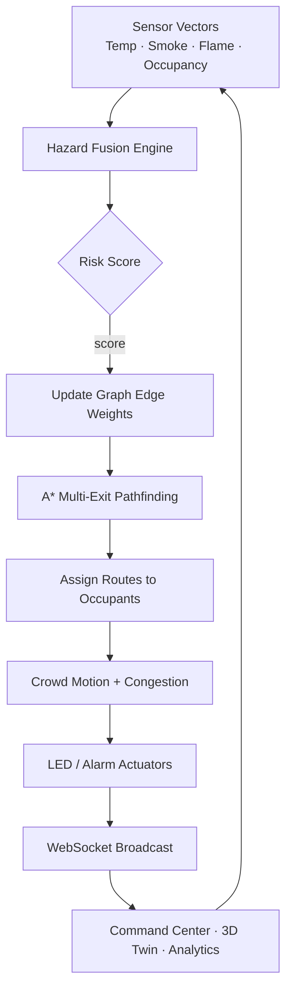

# FireExit — AI-Powered Smart Fire Evacuation Digital Twin

**FireExit** is an enterprise-style **command-center digital twin** for real-time fire evacuation. It fuses live **ESP32 IoT** telemetry with a building graph, hazard scoring, multi-exit pathfinding, and crowd simulation, then streams the result into a React / Three.js operations UI.

Design language: VisionOS glass · Tesla control surfaces · industrial SCADA · Google Maps–style path glow.

**Version 2.0** — production-oriented IoT + twin stack (FastAPI · React 19 · R3F · MQTT · Docker).

---

## Table of contents

1. [Problem statement](#1-problem-statement)
2. [Solution overview](#2-solution-overview)
3. [What was built](#3-what-was-built)
4. [System architecture](#4-system-architecture)
5. [End-to-end data flow](#5-end-to-end-data-flow)
6. [Algorithms & simulation logic](#6-algorithms--simulation-logic)
7. [IoT, firmware & device registry](#7-iot-firmware--device-registry)
8. [Frontend command center](#8-frontend-command-center)
9. [Technical challenges & how they were addressed](#9-technical-challenges--how-they-were-addressed)
10. [Tech stack](#10-tech-stack)
11. [Quick start](#11-quick-start)
12. [Docker & public tunnel](#12-docker--public-tunnel)
13. [Demo script](#13-demo-script)
14. [API & docs](#14-api--docs)
15. [Project layout](#15-project-layout)
16. [Tests](#16-tests)
17. [Security notes & future work](#17-security-notes--future-work)
18. [License](#18-license)

---

## 1. Problem statement

Commercial buildings still rely heavily on **static egress design**: fixed exit signs, paper evacuation plans, and fire panels that report alarms without explaining *where people should go next*. During a real incident those assumptions break down quickly.

### Real operational gaps

| Gap | Why it matters |
|-----|----------------|
| **Blocked or compromised exits** | Smoke, heat, debris, or locked doors can invalidate the “nearest exit” rule. Occupants following a fixed plan may walk into danger. |
| **Vertical fire / smoke dynamics** | Stairs and shafts accelerate smoke rise. A floor that looks safe on a 2D floor plan can become a trap within minutes. |
| **Sensor unreliability** | Devices go offline, batteries die, optical flame sensors are missing, or gas ADCs are noisy. A silent “0” reading is worse than an elevated unknown risk. |
| **No fused situational picture** | Temperature, gas/smoke, flame, and occupancy often live in separate silos. Operators cannot see a single hazard map tied to routes and people. |
| **Static crowd assumptions** | Plans ignore congestion. Two hundred people funneling into one stairwell creates queues, delay, and secondary risk. |
| **ESP32 / edge devices off-LAN** | Field sensors often cannot reach a laptop backend on a private Wi‑Fi. Public HTTPS ingest is required for demos and field trials. |
| **Operator cognitive load** | Without a digital twin, staff must mentally integrate alarms, CCTV, and radio reports under time pressure. |

### Research / product question

> Can we build a closed-loop digital twin that continuously fuses IoT hazards, recomputes multi-exit evacuation routes, simulates crowd motion, and presents a live command-center view operators can trust—even when sensors fail, exits block, and smoke spreads vertically?

FireExit answers that question with a working stack: **ingest → fuse → reweight graph → pathfind → crowd → broadcast → visualize**.

---

## 2. Solution overview

FireExit treats the building as a **live graph** of rooms, corridors, stairs, and exits. Every simulation tick (and every telemetry POST) updates node hazard, edge costs, routes, and occupant headings.

### Control loop



### Solution pillars

1. **IoT ingest** — Public `POST /api/telemetry` accepts ESP32 payloads every ~5 seconds (no JWT for field devices).
2. **Hazard fusion** — NIST-inspired weighted risk from flame, smoke, temperature, and crowd density.
3. **Dynamic routing** — Multi-exit A* (default) and Dijkstra with congestion-aware edge costs; automatic reroute when exits block.
4. **Crowd simulation** — Up to 1000 occupants with heading, soft collisions, queues, and `trapped` detection.
5. **Command center** — Dashboard KPIs, 3D R3F twin, SCADA IoT page, building designer, analytics, role-based access.
6. **Ops packaging** — Docker Compose (backend, frontend, Redis, Mosquitto, optional Postgres + ngrok tunnel profiles).

---

## 3. What was built

This section is the delivered feature set for **v2.0**.

### 3.1 Control-room UI

- Sticky frosted TopNav (clock, sim status, fire alert, search, notifications, profile)
- Collapsible glowing sidebar with module navigation
- Modules:
  - **Dashboard** — online/offline devices, hazard index, critical rooms, alerts
  - **Digital Twin** — React Three Fiber 3D scene + simulation controls
  - **Building Designer** — `@xyflow/react` graph editor → deploy layout to backend
  - **Sensor Network (IoT)** — SCADA-style search / filter / sort table
  - **Occupancy** — people filtered by status (evacuating, trapped, safe, …)
  - **Analytics** — overview, timeseries-style charts, heatmap cells, exit utilization
  - **Settings** — environment / prefs surface
- Dark glassmorphism, neon accents, Framer Motion motion, Inter typography
- JWT-protected routes with demo roles: admin / operator / viewer

### 3.2 ESP32 / IoT pipeline

- `POST /api/telemetry` pipeline:
  **validate → device registry → SQLAlchemy persist → MQTT → WebSocket → twin room update**
- Device **offline watchdog (15s)** without updates
- **Flame estimation** from temperature / gas when optical flame sensor is absent
- Gas → smoke proxy when dedicated smoke % is not provided
- SCADA IoT page: battery, signal, online flag, last seen
- Selection panel enrichment: humidity, gas, battery, signal, device id, travel time
- Optional room-name / floor → twin `nodeId` resolution (or explicit `nodeId` in payload)
- Device commands: `POST /api/device/{id}/command` (`ping`, `led`, `buzzer`, `reset`, `simulation`, …) via MQTT

### 3.3 Simulation & routing AI

- Fire / smoke / heat with **adjacent + vertical (stairs) spread** (~1.55× bias on vertical edges)
- Auto-ignition from critical / alarm / flame telemetry
- Multi-exit **A\*** + **Dijkstra**, congestion-aware edge costs
- Crowd engine: heading along paths, soft collisions, queue `wait_ticks`, spawn-max **1000**
- Extinguish, block / unblock exits, random fire & crowd scenarios
- Sensor-fail injection: degraded nodes apply elevated *unknown* risk (not silent zeros)
- Configurable spread / smoke / heat rates

### 3.4 Data, messaging & ops

- SQLAlchemy models: users, layouts, devices, telemetry samples, alerts, events, simulation runs
- Repository layer for IoT persistence (`repositories/iot.py`)
- MQTT bridge (`fireexit/device/{id}`, `fireexit/commands/{id}`) with local fail-safe if broker is down
- WebSocket `/ws/simulation` events: `snapshot`, `tick`, `status`, `telemetry`, `heartbeat`
- Docker Compose: frontend · backend · Redis · Mosquitto · optional Postgres · ngrok tunnel profiles
- Unit tests for hazard, flame estimate, offline timeout, and pathfinding
- ESP32 Arduino sample firmware
- Docs: Architecture, API, Deployment, Public Tunnel

---

## 4. System architecture

```
ESP32 ──HTTP POST /api/telemetry──► FastAPI
   │                                    │
   └── MQTT fireexit/device/{id} ───────┤
                                        ├── Redis (cache/ready)
                                        ├── Mosquitto MQTT
                                        ├── SQLite / Postgres
                                        └── WebSocket /ws/simulation
                                               │
                                               ▼
                                         React + R3F Twin
```

| Layer | Responsibility | Location |
|-------|----------------|----------|
| Frontend | Command center, 3D twin, designer, IoT SCADA | `frontend/` |
| API | Auth, simulation, IoT, building, analytics, WS | `backend/app/api/` |
| Engines | Hazard fusion, A*/Dijkstra | `backend/app/engines/` |
| Simulation | Tick loop, fire/smoke, crowd | `backend/app/simulation/` |
| Services | Device registry, telemetry pipeline, MQTT | `backend/app/services/` |
| Persistence | Models + IoT repositories | `backend/app/db/`, `repositories/` |
| Firmware | ESP32 Arduino HTTP telemetry | `firmware/` |
| Infra | Mosquitto, Docker, ngrok helper | `infra/`, `docker-compose.yml`, `scripts/` |

### Docker services

| Service | Port | Notes |
|---------|------|-------|
| `backend` | 8000 | FastAPI / Uvicorn, SQLite by default |
| `frontend` | 3000→80 | nginx; proxies `/api/` and `/ws/` |
| `redis` | 6379 | Cache / readiness |
| `mosquitto` | 1883 | MQTT broker |
| `ngrok` | 4040 | Profile `tunnel` → compose `backend:8000` |
| `ngrok-host` | 4040 | Profile `tunnel-host` → host uvicorn |
| `postgres` | 5432 | Profile `full` |

---

## 5. End-to-end data flow

1. **ESP32** (`firmware/esp32_fireexit_telemetry.ino`) samples temperature / gas / flame, derives SAFE → WARNING → CRITICAL, and POSTs JSON every **~5 seconds** to `{API_BASE}/api/telemetry`.
2. **API** (`api/iot.py`) validates with `TelemetryPayload` (Pydantic).
3. **Node mapping** — if `nodeId` is omitted, `device_registry.resolve_node_id(room, floor, nodes)` links the device to a twin room.
4. **Registry ingest** — flame estimate, gas→smoke, hazard score, status, alerts; mark device online.
5. **Persist** — upsert device, insert telemetry sample, log events / alerts (SQLite or Postgres).
6. **Twin update** — `simulation_engine.apply_iot_telemetry(...)` updates room sensors; **auto-ignites** on ALARM / CRITICAL / flame.
7. **MQTT** — publish state to `fireexit/device/{deviceId}`.
8. **WebSocket** — broadcast `{ event: "telemetry", data: { device, devices, snapshot } }`.
9. **Frontend** — `simStore` applies snapshot; `deviceStore` / `alertStore` refresh Dashboard, IoT, and Twin views.

Parallel to IoT, the **simulation tick loop** (~200 ms) spreads fire/smoke, refreshes routes (~1 s), moves the crowd, and broadcasts `tick` snapshots.

---

## 6. Algorithms & simulation logic

### 6.1 Hazard fusion (`engines/hazard.py`)

```
temperature_risk = normalize_exp(temp_C)     # ~22°C baseline → ~90°C critical
smoke_risk       = normalize(smoke_%)
flame_risk       = 1.0 if flame else 0.0
crowd_risk       = occupancy / capacity

Risk = 0.4·flame + 0.3·smoke + 0.2·temp + 0.1·crowd

Levels:
  safe      < 0.25
  warning   < 0.55
  danger    < 0.85
  critical  ≥ 0.85  (or flame ∧ high smoke)

EdgeCost = exp(6 · Risk) − 1
Blocked  if Risk ≥ 0.75  (cost → ~1e6)
```

### 6.2 Pathfinding (`engines/pathfinding.py`)

- Graph node types: room · corridor · stairs · exit
- Path cost accumulates distance × type multiplier + hazard + crowd (quadratic fill) + edge-flow congestion
- Stairs use a higher type multiplier (~1.45); A* heuristic = Euclidean + floor penalty
- `nearest_exit` evaluates all open exits and keeps the lowest-cost path
- `routes_for_all_rooms` drives glowing path overlays in the twin

### 6.3 Fire / smoke spread (`simulation/engine.py`)

- Burning rooms grow intensity / heat / smoke each tick
- Neighbors ignite with proximity bias; **vertical / stairs edges use ~1.55× multiplier**
- Smoke propagates faster than flame front
- Cool-down when nearby fire is extinguished

### 6.4 Crowd engine

- Occupants follow assigned path headings
- Soft collision separation (sampled per room for performance)
- Queue / wait ticks near congested nodes
- If no path exists during an active fire → occupant marked **`trapped`** + danger alert

### 6.5 LED / actuator semantics

| Color | Meaning |
|-------|---------|
| Green | Safe path |
| Yellow | High-smoke / warning alternate |
| Red | Danger |
| Pulsing red | Immediate / critical hazard |

---

## 7. IoT, firmware & device registry

### Device registry highlights

- In-memory map `deviceId → DeviceState` with DB upserts for durability
- Offline timeout **15 seconds**; watchdog poll every **~2 seconds**
- Deduped alerts (~20 s): fire, high temperature, gas leak, offline / online transitions
- Statistics for dashboard: online, offline, total, hazard index inputs

### Heuristics when hardware is incomplete

| Heuristic | Behavior |
|-----------|----------|
| `estimate_flame` | Explicit flame **or** (temp ≥ 70 & gas ≥ 800) **or** rate-of-rise **or** temp ≥ 85 |
| `gas_to_smoke` | Use smoke field if present; else `gas/40` clamped 0–100 |

### Sample telemetry payload

```json
{
  "deviceId": "DEV001",
  "room": "Office 101",
  "type": "ROOM",
  "floor": 1,
  "temperature": 42,
  "humidity": 35,
  "gasLevel": 1300,
  "status": "WARNING",
  "battery": 88,
  "signal": -62
}
```

Firmware sketch: [`firmware/esp32_fireexit_telemetry.ino`](firmware/esp32_fireexit_telemetry.ino)

### ESP32 smoke test (local)

```bash
curl -X POST http://localhost:8000/api/telemetry ^
  -H "Content-Type: application/json" ^
  -d "{\"deviceId\":\"DEV001\",\"room\":\"Office 101\",\"type\":\"ROOM\",\"floor\":1,\"temperature\":42,\"humidity\":35,\"gasLevel\":1300,\"status\":\"WARNING\",\"battery\":88,\"signal\":-62}"
```

---

## 8. Frontend command center

| Route | Page | Purpose |
|-------|------|---------|
| `/login` | Login | Demo role picker |
| `/dashboard` | Dashboard | KPIs, device health, hazard, alerts |
| `/twin` | Digital Twin | 3D R3F scene + sim controls |
| `/designer` | Building Designer | Edit & deploy building graph |
| `/iot` | Sensor Network | SCADA device table |
| `/occupancy` | Occupancy | People / status filters |
| `/analytics` | Analytics | Charts & utilization |
| `/settings` | Settings | App prefs |

**Zustand stores:** `authStore`, `simStore` (WebSocket + sim commands), `deviceStore`, `alertStore`, `designerStore`.

**Shared components:** `SimulationControls`, `FloorMap2D`, `SelectionPanel`, `ProtectedRoute`, shell / TopNav / sidebar.

---

## 9. Technical challenges & how they were addressed

Building FireExit was not only a UI + CRUD exercise. The hard parts were **closed-loop reliability**, **physics-ish hazard behavior**, and **getting real ESP32 hardware onto a developer laptop**.

### 9.1 Incomplete or missing sensors

**Challenge:** Many ESP32 kits ship without a reliable optical flame sensor; gas sensors report ADC counts, not calibrated smoke %.

**Approach:**
- `estimate_flame` combines absolute thresholds and rate-of-rise
- `gas_to_smoke` provides a bounded proxy so the hazard engine always has a smoke channel
- Status enums (SAFE / WARNING / ALARM / CRITICAL) remain first-class for firmware-side judgment

### 9.2 Offline and “zombie” devices

**Challenge:** A device that stops posting looks “safe” if the last reading was green.

**Approach:**
- 15-second offline watchdog marks devices offline and raises WARNING-class alerts
- Dashboard surfaces online vs offline counts explicitly
- Twin / registry keep `last_seen` for operator triage

### 9.3 Failed sensors must not read as zero risk

**Challenge:** Treating a dead sensor as 0 °C / 0% smoke under-reports hazard.

**Approach:**
- Simulation `sensor-fail/{node_id}` injects elevated unknown readings (e.g. ~45 °C / ~30% smoke)
- Fail-safe table in architecture docs: offline → elevated unknown risk, never silent

### 9.4 Vertical smoke and stairwell bias

**Challenge:** Horizontal-only spread underestimates how fast stairwells contaminate.

**Approach:**
- Adjacent spread with proximity weights
- Vertical / stairs edges get ~**1.55×** multiplier so smoke climbs faster than it spreads sideways

### 9.5 Blocked exits and dynamic rerouting

**Challenge:** Classic single-destination shortest path fails when the nearest exit becomes unsafe.

**Approach:**
- Multi-exit A* / Dijkstra over all open exits
- Blocked exits / high-risk edges get prohibitive cost
- Occupants with no remaining path are marked `trapped` and alerted

### 9.6 Congestion at bottlenecks

**Challenge:** Ideal geometric paths ignore queues at doors and stairs.

**Approach:**
- Crowd occupancy contributes to edge cost (quadratic fill)
- Edge-flow congestion terms discourage overloaded corridors
- Soft collision separation and wait ticks model local crowding

### 9.7 MQTT broker outages

**Challenge:** Field messaging must not freeze the twin if Mosquitto is down.

**Approach:**
- `MQTTBridge` logs failure and continues in local-only mode
- Simulation tick loop and HTTP telemetry ingest remain available
- UI still receives WebSocket updates from the API process

### 9.8 Persistence failures must not drop live situational awareness

**Challenge:** A DB write error during a fire event must not stop registry / MQTT / WS updates.

**Approach:**
- Telemetry pipeline logs persistence errors and continues broadcasting live state
- In-memory registry remains the hot path for the command center

### 9.9 ESP32 cannot reach localhost (and Windows AV blocks ngrok.exe)

**Challenge:** Physical boards need a public HTTPS URL. On many Windows machines, antivirus quarantines or blocks the native `ngrok.exe` binary.

**Approach:**
- Run **ngrok inside Docker** (`ngrok` / `ngrok-host` Compose profiles)
- Helper script `scripts/start-ngrok-docker.ps1` loads `NGROK_AUTHTOKEN` from `.env` or local ngrok config
- Compose no longer hard-fails core `up` when the token is unset (token still required to actually start tunnel services)
- Inspector at http://localhost:4040; full recipes in [`docs/PUBLIC_TUNNEL.md`](docs/PUBLIC_TUNNEL.md)

### 9.10 Twin desync with human-readable room names

**Challenge:** Firmware sends `"Office 101"` while the graph uses ids like `office_1`.

**Approach:**
- Room + floor fuzzy / name resolution into `node_id`
- Optional explicit `nodeId` in the telemetry payload for deterministic binding

### 9.11 Rendering 1000 agents at 60 FPS

**Challenge:** Engine capacity is 1000 occupants; naively drawing all agents in Three.js tanks the GPU.

**Approach:**
- Engine simulates full population
- Twin scene caps / lods people meshes for interactive frame rate while KPIs stay accurate

### 9.12 Role separation for demos vs operations

**Challenge:** Viewers should observe; operators should run scenarios; admins should reconfigure.

**Approach:**
- JWT roles with demo accounts
- Simulation mutation endpoints require operator/admin
- Viewer remains read-oriented for walkthroughs

### 9.13 Compose env interpolation vs optional tunnel profiles

**Challenge:** Docker Compose interpolates `${NGROK_AUTHTOKEN:?...}` for *all* services—even when tunnel profiles are not selected—so a missing token blocked ordinary `docker compose up`.

**Approach:**
- Softened to `${NGROK_AUTHTOKEN:-}` for optional tunnel services
- Scripts / docs still require a real token when starting ngrok

---

## 10. Tech stack

| Area | Choices |
|------|---------|
| Backend | Python 3.12, FastAPI, Uvicorn, Pydantic v2, SQLAlchemy 2, aiosqlite, python-jose, paho-mqtt, Redis client |
| Frontend | React 19, Vite, TypeScript, Zustand, Framer Motion, Recharts, Tailwind 4, React Router 7 |
| 3D / graphs | Three.js, React Three Fiber, Drei, `@xyflow/react`, d3 |
| Messaging | Eclipse Mosquitto 2, WebSockets |
| Infra | Docker Compose, Redis 7, optional Postgres 16, nginx, ngrok |
| Firmware | ESP32 Arduino (WiFi, HTTPClient, ArduinoJson) |
| Tests | pytest, pytest-asyncio |

---

## 11. Quick start

### Local development

```bash
# Backend
cd backend
python -m venv .venv
.venv\Scripts\activate          # Windows
pip install -r requirements.txt
uvicorn app.main:app --reload --port 8000

# Frontend
cd frontend
npm install
npm run dev
```

- UI: http://localhost:5173  
- API / OpenAPI: http://localhost:8000/docs  

### Demo users

| User | Password | Role |
|------|----------|------|
| admin | admin123 | Full |
| operator | operator123 | Simulate |
| viewer | viewer123 | Read-only |

---

## 12. Docker & public tunnel

### Full stack

```bash
docker compose up -d --build
```

| Service | URL |
|---------|-----|
| UI | http://localhost:3000 |
| API | http://localhost:8000 |
| OpenAPI | http://localhost:8000/docs |
| MQTT | localhost:1883 |
| Redis | localhost:6379 |

Optional Postgres:

```bash
docker compose --profile full up -d --build
```

### Public ESP32 tunnel (ngrok in Docker)

Host antivirus often blocks `ngrok.exe`. Prefer Docker:

```powershell
# 1. Start Docker Desktop
# 2. Put token in .env  →  NGROK_AUTHTOKEN=...
# 3. Tunnel compose backend:
docker compose --profile tunnel up -d ngrok
#    or helper (host uvicorn mode by default):
.\scripts\start-ngrok-docker.ps1 -Mode compose
```

- Inspector: http://localhost:4040  
- Details: [docs/PUBLIC_TUNNEL.md](docs/PUBLIC_TUNNEL.md)

---

## 13. Demo script

1. Login `admin` / `admin123`
2. **Digital Twin** → Start → Start Fire → watch spread & glowing routes
3. Block an exit → automatic reroute
4. POST telemetry (section 7) → IoT page + twin room update
5. Dashboard KPIs: online/offline devices, hazard index, critical rooms
6. Building Designer → edit graph → deploy layout
7. Optional: open ngrok inspector and POST to the public `/api/telemetry` URL from another network

---

## 14. API & docs

| Doc | Contents |
|-----|----------|
| [Architecture](docs/ARCHITECTURE.md) | Control loop, hazard math, fail-safes, LED semantics |
| [API](docs/API.md) | Auth, simulation, IoT, building, analytics, WebSocket, MQTT |
| [Deployment](docs/DEPLOYMENT.md) | Docker, ESP32, security, capacity targets |
| [Public tunnel](docs/PUBLIC_TUNNEL.md) | Ngrok Docker recipes |

Capacity targets (deployment guide): ~100 rooms, ~100 ESP32s, ~1000 occupants; tick ~200 ms; path refresh ~1 s; UI ~60 FPS with people mesh capping.

---

## 15. Project layout

```
FIRE-EXIT/
├── backend/app/
│   ├── api/            # auth, building, simulation, analytics, iot, alerts, websocket
│   ├── engines/        # hazard fusion, A*/Dijkstra
│   ├── simulation/     # tick engine, fire, crowd, default layout
│   ├── services/       # MQTT, device registry, telemetry pipeline
│   ├── repositories/   # SQLAlchemy IoT repos
│   ├── schemas/        # Pydantic telemetry / commands
│   ├── core/           # JWT security + demo users
│   └── db/             # models + session
├── frontend/src/
│   ├── pages/          # Dashboard, Twin, Designer, IoT, Occupancy, Analytics, Settings
│   ├── stores/         # auth, sim, designer, device, alert
│   └── components/     # Shell, controls, maps, selection panel
├── firmware/           # ESP32 Arduino sample
├── docs/               # Architecture, API, Deployment, Public Tunnel
├── infra/              # Mosquitto config
├── scripts/            # start-ngrok-docker.ps1
└── docker-compose.yml
```

---

## 16. Tests

```bash
cd backend
pytest tests/ -q
```

Covered in `backend/tests/test_core.py`:

- Hazard scoring (safe vs critical flame)
- Flame estimate + gas→smoke heuristics
- Device registry offline timeout
- A* / Dijkstra / nearest-exit reachability

---

## 17. Security notes & future work

### Current posture (demo-ready, not hardened production)

- Demo JWT users with fixed passwords — change before any shared deployment
- Public telemetry endpoint has **no per-device auth** yet (documented security debt)
- Mosquitto allows anonymous local clients in the sample config
- Default `SECRET_KEY` must be rotated

### Recommended hardening

- Device tokens / mTLS for `/api/telemetry`
- TLS termination at reverse proxy
- Disable anonymous MQTT; ACL per device topic
- Postgres + backups for multi-host deployments
- Rate limiting and payload size caps on public ingest

### Natural next steps

- Calibrated multi-sensor fusion (PM2.5, CO, real optical flame)
- Persist full simulation runs for after-action review
- Mobile occupant guidance view driven by the same routes
- Hardware-in-the-loop LED / buzzer actuation from MQTT commands
- Stronger automated integration tests around WebSocket tick streams

---

## 18. License

MIT — emergency-response / smart-building digital twin demonstration platform.
