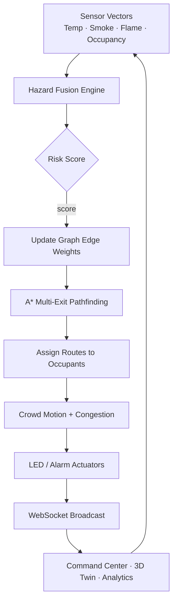

# System Architecture & Hazard Logic

## Real-time control loop



## Hazard fusion

```
temperature_risk = normalize_exp(temp_C)     # baseline 22°C → critical 90°C
smoke_risk       = normalize(smoke_%)
flame_risk       = 1.0 if flame else 0.0
crowd_risk       = occupancy / capacity

Risk = 0.4·flame + 0.3·smoke + 0.2·temp + 0.1·crowd

Levels:
  safe      < 0.25
  warning   < 0.55
  danger    < 0.85
  critical  ≥ 0.85  (or flame ∧ high smoke)

EdgeCost = exp(6 · Risk) − 1
Blocked  if Risk ≥ 0.75  (cost → 1e6)
```

## Path cost

```
PathCost = Σ (distance · type_mult + hazard_cost + crowd_cost)
```

Stairs use `type_mult = 1.4`. A* heuristic = Euclidean + floor penalty.

## Fail-safe behavior

| Failure | Fallback |
|---------|----------|
| Sensor offline | Elevated unknown risk (not silent) |
| MQTT broker down | Local-only simulation continues |
| Exit blocked | Automatic multi-exit reroute |
| No path found | Occupant marked `trapped` + alert |

## LED matrix semantics

| Color | Meaning |
|-------|---------|
| Green | Safe path |
| Yellow | High-smoke / warning alternate |
| Red | Danger |
| Pulsing red | Immediate / critical hazard |
